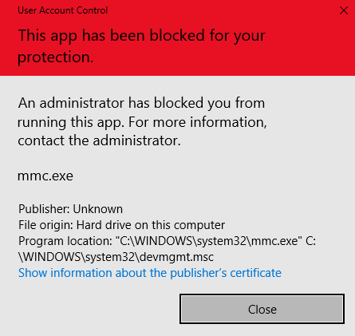

## About this file
It addresses issues with Chrome and other apps being slowed down by Windows, as discussed in this thread: 
https://productforums.google.com/forum/?utm_medium=email&utm_source=footer#!msg/chrome/3OJC764nVQs/Ce6xsBlBAgAJ

## Instructions
1. Download this .bat file and store it somewhere on your computer.
2. Set up a cronjob to regularly execute it, making sure it runs as administrator.
  2a. From the start menu, type "Task Scheduler" and open it as administrator.

"C:\Users\Joey's PC\scripts\cryptographic_services_stopper\cryptographic_services_stopper.bat"

action -> create task
general
name: cryptographic_services_stopper
run whether user is logged on or not
run with highest privileges
configure for: windows 10

conditions
disable "start the task only if the computr is on AC power"

actions
new
action: start a prorgram
settings: program/script: "C:\Users\Joey's PC\scripts\cryptographic_services_stopper\cryptographic_services_stopper.bat"
OK

triggers
new (1):
begin the task: at log on
settings -> any user
advanced settings ->
repeat task every: 15 minutes
for the duration of: indefinitely
stop task if it runs longer than: 30 minutes
enabled:
activate: now
ok

ok
add password

## Possible side effects
### UAC Error
It is possible that, when stopping Cryptographic Services, you will occasionally receive an issue where when you try to open a certain system program or access certain system settings, you will see the following error appear:

> **This app has been blocked for your production**
> An administrator has blocked you from running this app. For more information, contact the administrator.
> `mmc.exe`
_...and so on_

## Troubleshooting
### Failed to open Task Scheduler
When trying to open the task scheduler to run this batch script on a regular basis, you may receive the error "UAC Error" as described in the "Possible side effects sections"

Take the following steps to attempt to solve this issue:
1. Try activating administrator and opening again on your regular Windows account
To resolve this issue, open cmd or powershell as administrator, and execute the following line:

`net user administrator /active:yes`

2. Try deactivating administrator and opening again on your regular Windows account
Open cmd or powershell as administrator, and execute the following line:

`net user administrator /active:no`

3. Create the task after logging in as the "Administrator" user
_These steps have been sourced from this video: https://www.youtube.com/watch?v=VDA1URdYRME _

- 
